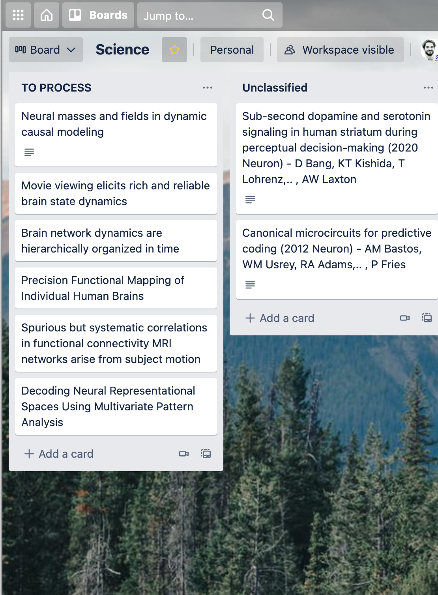

ARTicle CATaloging System
---

Simple tool to system to catalog and systematize articles from an article name to a trello board. 
Trello board will be used for processing / reading the materials further.

## install

    virtualenv -p python3 venv

    pip install -r requirements.txt

    source set_env.sh 

Set env in `.env`:

    TRELLO_APIKEY=...
    TRELLO_TOKEN=...
    SCRAPPER_API=...

### Test Trello api:

    curl "https://api.trello.com/1/members/me/boards?key=${TRELLO_APIKEY}&token=${TRELLO_TOKEN}"

    BOARD_ID=60bfac13cbcf346200b1f259
    curl "https://api.trello.com/1/boards/${BOARD_ID}/lists?key=${TRELLO_APIKEY}&token=${TRELLO_TOKEN}"
    curl "https://api.trello.com/1/boards/${BOARD_ID}/cards?key=${TRELLO_APIKEY}&token=${TRELLO_TOKEN}"
    curl "https://api.trello.com/1/boards/${BOARD_ID}/plugins?key=${TRELLO_APIKEY}&token=${TRELLO_TOKEN}"

    LIST_ID=60bfb3a904f57b2d47419510
    curl "https://api.trello.com/1/lists/${LIST_ID}/cards?key=${TRELLO_APIKEY}&token=${TRELLO_TOKEN}"

    CARD_ID=619b3fef5728a36536de7d27
    curl --request GET \
        --url 'https://api.trello.com/1/cards/${CARD_ID}/customFieldItems?key=${TRELLO_APIKEY}&token=${TRELLO_TOKEN}'

    curl "https://api.trello.com/1/cards/${CARD_ID}?key=${TRELLO_APIKEY}&token=${TRELLO_TOKEN}"

Process
---

- Keep all unprocessed tickets in `TO PROCESS` Trello list. 
- Once it is processed it moves to `Unclassified` Trello list. Here it will be picked and moved to the correct list.

Two ways to move from `TO_PROCESS` to `Unclassified`:

1. Use Google Search directly:

        py main.py next-trello 

        py main.py next-trello --force

2. Download the document manually and process the HTML

Search for the paper title in Chrome directly in Google Scholar: `gs` search engine.
Save the file locally and then process it with the script:

        py main.py read-html "<PATH_TO_FILE.html>"

Example
---

